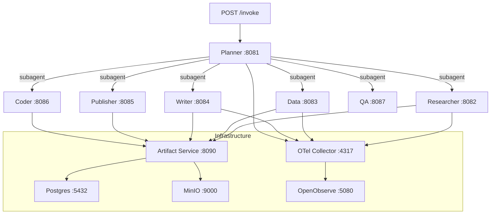
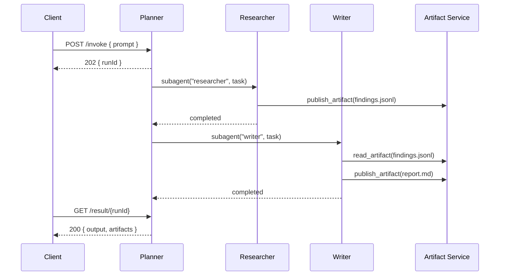

# pi-agent-workforce

[](https://github.com/evanokeefe39/pi-agent-workforce/actions/workflows/ci.yml)


Multi-agent workforce powered by [Pi](https://github.com/badlogic/pi-mono) agents in Docker containers, orchestrated via [pi-subagents-http](https://github.com/nicobailon/pi-subagents). A planner decomposes goals into tasks, delegates to specialist agents, assesses quality, and iterates until done.

## Architecture



## Request flow



## Agents

| Agent | Port | Role |
|-------|------|------|
| Planner | 8081 | Goal decomposition, delegation, quality assessment |
| Researcher | 8082 | Web research, structured findings with ADMIRALTY grading |
| Data | 8083 | Data scraping, DuckDB analytics, ETL |
| Writer | 8084 | Long-form documents, style engine, section fanout |
| Publisher | 8085 | Content distribution with HITL gating |
| Coder | 8086 | Code execution, rendering (Chromium + React + Playwright) |
| QA | 8087 | Review gating, brand compliance, quality verdicts |

## Prerequisites

- [Docker Desktop](https://www.docker.com/products/docker-desktop/) (with Docker Compose v2)
- API key for at least one LLM provider (DeepSeek recommended)
- Git

## Quickstart

```bash
git clone https://github.com/evanokeefe39/pi-agent-workforce.git
cd pi-agent-workforce

# Configure API keys
cp .env.example .env
# Edit .env — add your DEEPSEEK_API_KEY at minimum

# Build and start all services
docker compose up -d --build

# Wait for health checks (agents take ~60s to initialize)
docker compose ps

# Send a task to the planner
curl -X POST http://localhost:8081/invoke \
  -H "Content-Type: application/json" \
  -d '{"prompt": "Research the top 3 trends in AI agents for 2026. Publish a structured findings dataset and a summary report."}'

# Poll for results
curl http://localhost:8081/result/{runId}
```

## Usage

Delegation via the planner's subagent-http extension:

```
# Single agent, blocking
subagent({ agent: "researcher", task: "Research X" })

# Parallel delegation
subagent({ tasks: [
  { agent: "researcher", task: "Research A" },
  { agent: "researcher", task: "Research B" }
]})

# Agent discovery
subagent({ action: "list" })
```

## Infrastructure

| Service | Purpose |
|---------|---------|
| **Artifact Service** | HTTP bridge between agents and storage (Bun) |
| **Postgres** | Artifact metadata, search, type constraints |
| **MinIO** | S3-compatible object storage for artifact content |
| **OTel Collector** | Receives gRPC traces from agents, exports to OpenObserve |
| **OpenObserve** | Distributed traces, logs, metrics dashboard at :5080 |

Cross-agent traces are linked via W3C traceparent header propagation — every agent invocation appears in a single trace tree.

## Observability

All agents export traces via gRPC to the OTel Collector. View in OpenObserve at `http://localhost:5080`.

Each agent run produces spans for:
- `pi.interaction` — full agent session
- `pi.turn` — individual LLM turn
- `pi.llm_request` — raw model API call

## Project structure

```
src/agents/              # All agent code
  server.ts              # Shared HTTP server (Bun + Fastify)
  jidoka.ts              # Output validation (zero-output, required tools, max turns)
  Dockerfile             # Multi-stage build, per-agent targets
  {agent}/.pi/agent/     # Per-agent config (AGENTS.md, config.yml, settings.json)
  {agent}/agent.json     # Validation config (maxTurns, requiredTools)
  extensions/            # Shared Pi extensions
src/artifact-service/    # Artifact store service (Bun)
tests/e2e/               # End-to-end tests (Bun + legacy bash)
docs/                    # Model selection, research
```

## Documentation

| Doc | Purpose |
|-----|---------|
| [Getting Started](docs/getting-started.md) | Setup, first task, troubleshooting |
| [Architecture](docs/architecture.md) | System design, delegation, session isolation, artifact flow |
| [API Reference](docs/api-reference.md) | HTTP endpoints, request/response formats, concurrency |
| [Agents](docs/agents.md) | Each agent's role, tools, extensions, and capabilities |
| [Toyota Way Principles](docs/toyota-way-principles.md) | TPS principles applied to multi-agent systems |
| [Model Selection](docs/model-selection.md) | Model decisions, provider catalog, fallback chains, cost |
| [CLAUDE.md](CLAUDE.md) | Development quick-reference — key files, gotchas |
| [CONTRIBUTING.md](CONTRIBUTING.md) | Git workflow, branch conventions, PR process |
| [ISSUES.md](ISSUES.md) | Known issues, partial fixes, resolved issues |
| [MILESTONE.md](MILESTONE.md) | Project history and milestone tracking |

## Background

Architecture chosen after evaluating [Paperclip](https://github.com/badlogic/paperclip) (issue-based delegation) and pi-subagents (subprocess spawning). See [paperclip-eval EVALUATION.md](https://github.com/evanokeefe39/paperclip-eval/blob/main/EVALUATION.md) for the full comparison.
