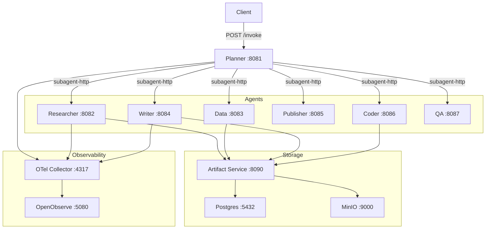
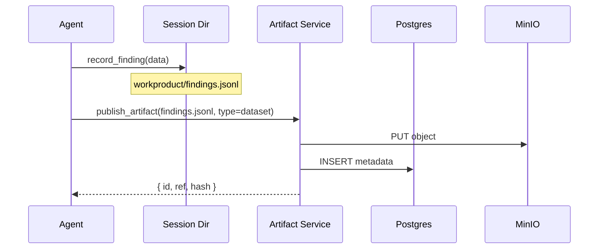

# Architecture

## Overview

pi-agent-workforce is a multi-agent system where each agent runs as an independent Docker container exposing an HTTP API. A planner agent decomposes goals, delegates to specialist agents, and iterates until quality criteria are met.



## Agent model

Every agent runs the same server binary (`server.ts`) with Bun + Fastify. What makes each agent unique is its configuration:

| Config file | Purpose |
|-------------|---------|
| `AGENTS.md` | System prompt — defines the agent's role, workflow, and constraints |
| `config.yml` | Model roles, fallback chains, retry policy |
| `settings.json` | Default provider/model, pi-otel settings |
| `agent.json` | Metadata + validation config (maxTurns, requiredTools) |
| `pi-permissions.jsonc` | Tool allowlist — which tools the agent may use |

All config lives at `src/agents/{name}/.pi/agent/`.

## Delegation

The planner delegates via the `subagent-http` extension, which makes HTTP calls to other agent containers:

```
subagent({ agent: "researcher", task: "Research topic X" })
```

Delegation is blocking — the planner waits until the agent completes. For parallel work:

```
subagent({ tasks: [
  { agent: "researcher", task: "Research A" },
  { agent: "researcher", task: "Research B" }
]})
```

Each agent supports concurrent sessions (configurable via `MAX_CONCURRENT_SESSIONS`).

## Session isolation

Every invocation creates an isolated workspace:

```
/workspace/sessions/{requestId}/
  output/       — final output files
  workproduct/  — structured findings, metrics, charts
  scratch/      — temporary files, compacted tool results
```

The Pi SDK's `cwd` is set to the session directory, so all file operations are scoped to that invocation. Concurrent requests get separate directories.

## Artifact flow

Agents produce artifacts (research findings, reports, images) and publish them to the artifact service:



Workproduct tools write validated local files. `publish_artifact` uploads them. Two steps, zero coupling.

## Observability

All agents export OpenTelemetry traces via gRPC to the OTel Collector, which forwards to OpenObserve.

Cross-agent trace propagation: when the planner delegates to an agent, `subagent-http` injects a W3C `traceparent` header. The receiving agent extracts it and parents its trace under the caller's span. Result: one trace tree per pipeline run, visible in OpenObserve.

Span hierarchy per agent:
- `pi.interaction` — full agent session
- `pi.turn` — individual LLM turn
- `pi.llm_request` — raw model API call

## Jidoka (output validation)

Named after the Toyota Production System concept of "automation with a human touch." Pure validation functions in `jidoka.ts`, called by `server.ts` after each run:

| Check | Behavior |
|-------|----------|
| Zero-output | 0 output tokens = run failed |
| Turn breaker | Abort at maxTurns via AbortController |
| Required tools | Post-run check that specified tools were called |
| Mid-run warning | Every 10 turns, log if required tools not yet used |

Validation config is driven by each agent's `agent.json`:

```json
{
  "runtimeConfig": {
    "validation": {
      "maxTurns": 60,
      "requiredTools": ["record_finding", "publish_artifact"]
    }
  }
}
```

## Extensions

Pi extensions add tools and capabilities to agents. Shared extensions live at `src/agents/extensions/`:

| Extension | Purpose |
|-----------|---------|
| `artifacts` | `publish_artifact`, `read_artifact`, `list_artifacts` tools |
| `context-compaction` | Truncates large tool results to prevent context bloat |
| `deep-research` | Multi-step research with source tracking |
| `duckdb` | SQL analytics via DuckDB |
| `subagent-http` | HTTP delegation to other agents (planner only) |
| `tool-policy` | RBAC enforcement from rbac.json |
| `web-scrape` | Web scraping with Apify integration |
| `workproduct` | `record_finding`, `record_metric`, `record_chart` tools (factory-generated) |
| `writing-style` | Vale linter integration, style validation |

Extensions are configured per-agent in the Dockerfile — the planner gets `subagent-http` but not research tools, enforcing delegation over direct action.

## Docker build

Multi-stage Dockerfile at `src/agents/Dockerfile`:

```
base (node:22-slim + Bun + shared deps + extensions)
  ├─ planner (subagent-http, no research tools)
  ├─ researcher-deps (Python + Scrapling + Cheerio)
  │   ├─ researcher
  │   └─ data-deps (ffmpeg + Chromium + DuckDB)
  │       └─ data
  ├─ coder-deps (Chromium + React + Playwright + esbuild)
  │   └─ coder
  ├─ writer-deps (Vale linter)
  │   └─ writer
  ├─ publisher
  └─ qa
```

Each agent inherits from `base` (or a deps stage) and adds its own config. The `base` stage installs the Pi SDK, Bun, Fastify, and shared extensions.
